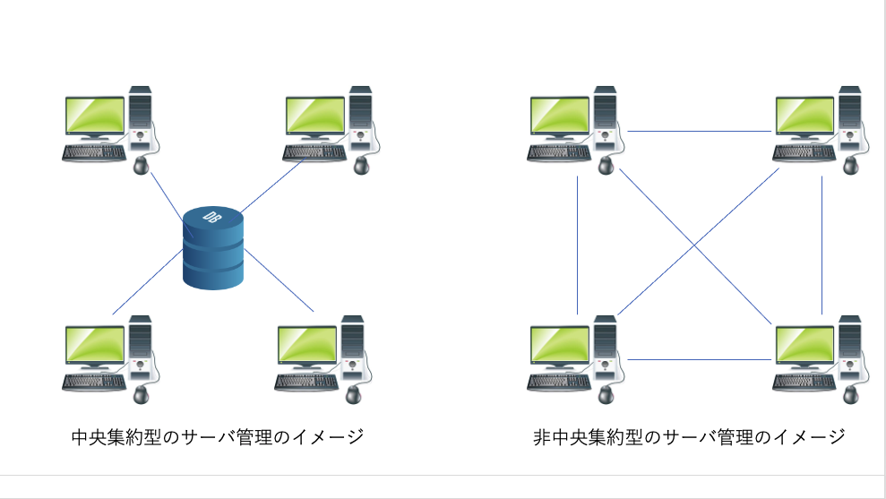

# 1.興味を持ったテーマ
非中央集権ID管理サービスの開発と評価
# 2.調べたキーワードや技術
調べたキーワードまたは技術は、分散ID、Web3、DID、VC、PKI、ブロックチェーン、Web拡張機能である。

まず、ブロックチェーンとは、ブロックチェーンは情報を記録するデータベース技術の一種で、ブロックと呼ばれる単位でデータを管理し、それを鎖（チェーン）のように連結してデータを保管する技術のことである。

この研究では、プラットフォーマーがIDとパスワードを管理するのではなく、利用者自身がログイン情報やアプリケーションの利用履歴などを管理するとなっている。

つまり、中央集権型のデータ管理ではなく、非中央集権型のデータ管理をしようとしているのである。

その理由をいかに記述する。

中央集権型の管理では、
どのような意思決定が行われ、どのように管理されているのかが、中央集権型の管理では開示されないことが多いからである。
また、インターネットにおけるデータ管理などもその一例である。例えば、データを一元管理しているサービス提供企業は、保管データを管理企業が見れてしまう状況にあり、機密性、安全性に関する懸念がある。

一つのデータサーバーでのみデータを管理していれば、ハッキングや悪用の可能性も高まる。

この問題を解決できるのは、ブロックチェーン技術を利用した非中央集権型のデータ管理方法である。

中央集権型のサーバーとは異なり、非中央集権型のデータ管理方法は１つの場所にデータを記録管理する方法ではなく、ネットワークの参加者が共通の台帳を持つ方法である。

この技術は、ブロックチェーンの機能の一つであり、ブロックチェーンのネットワークに参加している参加者がそれぞれ同じ台帳を管理、共有することができる技術である。

ブロックチェーンには、誰が、いつ、どのような情報を書き込んだのか参加者同士が検証、承認、監視し合うことで記録が更新されるため、偽の情報の記録や改ざんをすることが極めて困難である。

そのため中央集権型のデメリットであった機密性、セキュリティリスクを改善することができる。（819）

# 3．自身が理解した内容を描いた自作の図

# 4．参考文献
 

Daniel Drescher（著）　クイープ（翻訳）　.徹底理解ブロックチェーン ―ゼロから着実にわかる次世代技術の原則―（Impress top gear） . インプレス
 . 
2018/07 . [344p]